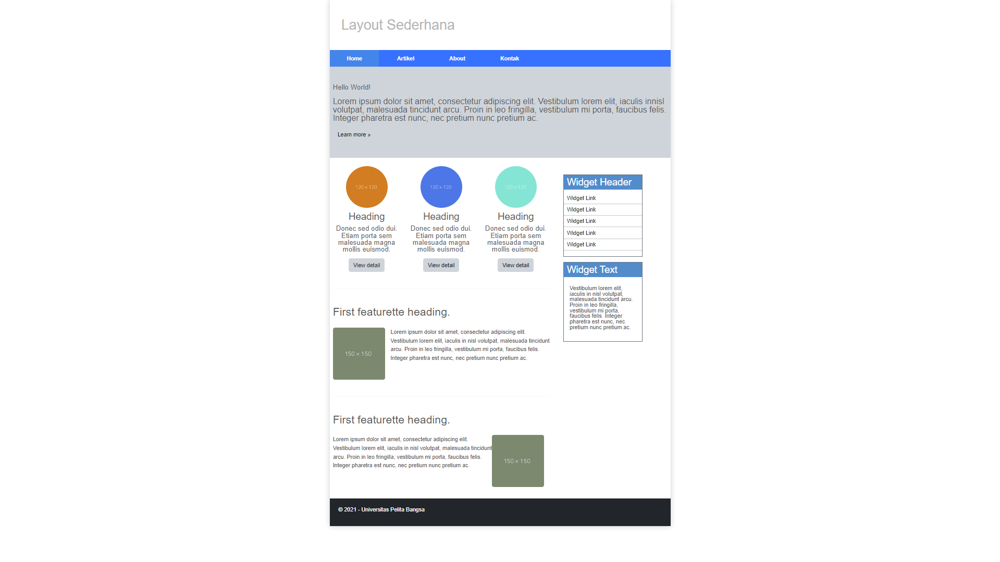

# Lab6Web

| Nama  | Ahmad Hapizhudin |
| ----- | ---------------- |
| NIM   | 312210370        |
| Kelas | TI.22.A4         |

# Praktikum 6: Web Framework

## Tujuan

1. Mahasiswa mampu memahami konsep dasar dari web framework.
2. Mahasiswa mampu memahami struktur dasar layout web menggunakan css framework.
3. Mahasiswa mampu memahami elemen-elemen css framework.

## Instruksi Praktikum

1. Persiapkan text editor misalnya VSCode.
2. Buat folder baru dengan nama lab6_css_framework.
3. Buat file baru dokumen html.
4. Buat struktur dasar dari dokumen HTML.
5. Buatlah layout web sederhana menggunakan css framework (Twitter Bootstrap).
6. Lakukan validasi dokumen html dengan mengakses [http://validator.w3.org](http://validator.w3.org).

# Twitter Bootstrap 5 (Bootstrap v5)

Twitter Bootstrap 5, atau Bootstrap v5, adalah kerangka kerja front-end open source yang digunakan untuk membangun situs web dan aplikasi web responsif. Dikembangkan oleh Twitter, Bootstrap menyediakan berbagai komponen dan gaya pradesain yang memudahkan pengembang dalam membangun tampilan yang menarik dan responsif dengan cepat. Bootstrap v5 adalah versi terbaru dari Bootstrap yang menghadirkan perbaikan, komponen baru, dan peningkatan performa. Ini sangat cocok untuk proyek-proyek pengembangan web modern.

## Fitur Utama:

- **Grid System yang Fleksibel:** Bootstrap memungkinkan pembuatan tata letak yang responsif dengan mudah menggunakan grid system berbasis kolom.
- **Komponen UI:** Bootstrap menyediakan berbagai komponen UI seperti tombol, jumbotron, kartu, dan lainnya yang siap digunakan.
- **Desain Responsif:** Bootstrap mendukung desain responsif yang optimal, memastikan tampilan yang baik di berbagai perangkat dan resolusi layar.
- **Kustomisasi Mudah:** Anda dapat menyesuaikan tampilan Bootstrap sesuai dengan kebutuhan Anda dengan menggunakan variabel Sass dan alat-alat kustomisasi.
- **Dokumentasi yang Kaya:** Bootstrap dilengkapi dengan dokumentasi yang kaya dan contoh-contoh kode untuk membantu pengembang memahami dan menggunakannya dengan efisien.

Untuk informasi lebih lanjut, kunjungi [situs resmi Bootstrap](https://getbootstrap.com/).

## Struktur Dasar HTML Menggunakan Twitter Bootsrapt

```html
<!DOCTYPE html>
<html lang="en">
  <head>
    <meta charset="utf-8" />
    <meta name="viewport" content="width=device-width, initial-scale=1" />
    <title>Bootstrap demo</title>
    <link
      href="https://cdn.jsdelivr.net/npm/bootstrap@5.3.2/dist/css/bootstrap.min.css"
      rel="stylesheet"
      integrity="sha384-T3c6CoIi6uLrA9TneNEoa7RxnatzjcDSCmG1MXxSR1GAsXEV/Dwwykc2MPK8M2HN"
      crossorigin="anonymous"
    />
  </head>
  <body>
    <h1>Hello, world!</h1>
    <script
      src="https://cdn.jsdelivr.net/npm/bootstrap@5.3.2/dist/js/bootstrap.bundle.min.js"
      integrity="sha384-C6RzsynM9kWDrMNeT87bh95OGNyZPhcTNXj1NW7RuBCsyN/o0jlpcV8Qyq46cDfL"
      crossorigin="anonymous"
    ></script>
  </body>
</html>
```

Dari sini kita melihat bahwa ada beberapa hal yang berbeda dari struktur dasar HTML biasa. yaitu adanya penamabahan tag <link\> yang mengarah kepada tautan ke file CSS Bootstrap dan atribut-atribut yang terkait. yaitu sebagai berikut :

### Stylesheet Bootstrap


### Script Bootsrtapt


## Tugas Praktikum 6

Berdasarkan gambar layout web berikut, buatlah menggunakan Twitter Bootstrap.


<h2 align="center"> HTML </h2>

Untuk **Source codenya** bisa dilihat [disini](/index.html)

<h2 align="center"> CSS </h2>

Untuk **Source codenya** bisa dilihat [disini](/style.css)

<h2 align="center"> Screenshoot </h2>



## TERIMAKASIH
